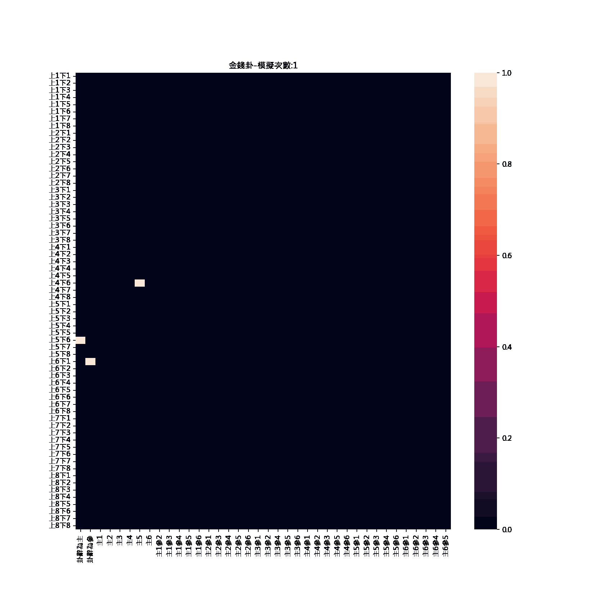

#  金錢卦斷卦機率模擬 I Ching Divination With Coins Using Monte Carlo Simulation

## 破題

金錢卦為本人最常用的占卜法，比起納甲或火珠林的方式更為純粹，且更接近易的本質（個人觀點）。本文是一個閒暇之餘的實作，以蒙地卡羅的方式嘗試視覺化金錢卦所有可能性的機率分佈，對於懶的去計算所有排列組合並求得機率的我來說，透過大數法則看到慢慢堆疊出來的分佈比較有趣。

在繼續閱讀前煩請掌握以下幾個原則：

- 小卜怡情，請活在當下、享受生命
- 本文沒有打算教些什麼或是推廣什麼
- 本人非五術專業人士，有錯誤也歡迎指教

金錢卦的占斷規則採用[易學網](https://www.eee-learning.com/)的[方便的進階卜卦法－用三個銅板卜卦](https://www.eee-learning.com/content/8)的方式，斷卦方式共有38種，是故六十四卦共有$64*38=2432$種斷卦可能，共可分為以下幾類：

- 單一卦辭為主（無爻變） * 1
- 單一卦辭為參（三爻變）* 1
- 單一爻辭為主（一爻變 or 五爻變）* 6
- 上爻為主下爻為參（二爻變）* 15
  - 第六爻為主+第五爻為參、第六爻為主+第四爻為參、…、第六爻為主+第一爻為參 （5）
  - 第五爻為主+第四爻為參、第五爻為主+第三爻為參、…、第五爻為主+第一爻為參（4）
  - 第四爻為主+第三爻為參、第四爻為主+第二爻為參、第四爻為主+第一爻為參（3）
  - 第三爻為主+第二爻為參、第三爻為主+第一爻為參（2）
  - 第二爻為主+第一爻為參（1）
- 下爻為主上爻為參（四爻變）* 15
  - 第一爻為主+第二爻為參、第一爻為主+第三爻為參、…、第一爻為主+第六爻為參 （5）
  - 第二爻為主+第三爻為參、第二爻為主+第四爻為參、…、第二爻為主+第六爻為參 （4）
  - 第三爻為主+第四爻為參、第三爻為主+第五爻為參、第三爻為主+第六爻為參（3）
  - 第四爻為主+第五爻為參、第四爻為主+第六爻為參（2）
  - 第五爻為主+第六爻為參（1）

舉幾個計算上的例子做說明：

- 如有三個爻變出現，則變卦的「單一卦辭為主」會被加1，同時本卦的「單一卦辭為主」也會加1
- 如有五個爻變出現，則變卦不變的那一爻的「單一爻辭為主」會被加1
- 如有六個爻變出現，且非乾坤兩卦的情況，則變卦的「單一卦辭為主」會被加1
- 如有六個爻變出現，且為乾坤兩卦的情況，則本卦的「單一爻辭為主」會被加1

總而言之，本分類從六十四卦出發，並以斷卦方式為另一個向度，因此爻辭的部份就不使用「某爻辭為主」、「某爻辭為參」這種以爻辭為主體的分類。

而本文選用金錢卦為主的理由不外乎是其提供了較揲蓍法更公平的機率分佈（有興趣請參考[此文章](https://www.eee-learning.com/article/3368)），金錢卦巧妙地透過離散機率$[\frac{1}{8}(老陰),\frac{3}{8}(少陰),\frac{3}{8}(少陽))\frac{1}{8}(老陽)]$去近似連續的常態分佈，整個起卦流程只能用elegent來形容（個人觀點）。

### 常用系統的比較

- 金錢卦：$64*38=2432$種
- 略筮法：$64*6=384$種
- 焦氏易林：$64*64=4096$種

以上是個人常用的三種卜卦方式，有時間不怕吵就用金錢卦，趕時間的話就用略筮法，需要有客觀環境的資訊就會使用焦氏易林，基本上最多就是這樣（或是說會發現這樣就很足夠了）。當然導入五行論卦可以把排列組合瞬間擴充，只是有時繞了一大圈再重新relabeling回去，還是會發現一開始的那些純粹的類別才是最實在的（個人觀點）。

### 如何理解這張圖？

若我們把上述的38種情形放在x軸，而六十四卦放在y軸，就可以羅列出金錢卦共2432種斷卦可能性。為方便閱讀，y軸使用上+下卦的組合進行命名，請參考下表進行對照：

| **☰ 天** | **☱ 澤** | **☲ 火** | **☳ 雷** | **☴ 風** | **☵ 水** | **☶ 山** | **☷ 地** |
| -------- | -------- | -------- | -------- | -------- | -------- | -------- | -------- |
| 1        | 2        | 3        | 4        | 5        | 6        | 7        | 8        |

如上4下3就是雷火豐、上2下5就是澤風大過（至於為什麼不直接把六十四卦寫上去，純粹只是覺得麻煩而已），而x與y對應的顏色就會是機率。

從圖中不難看出，就機率來看，`卦辭為主 > 卦辭為參 > 單一爻辭 > 上爻為主下爻為參 > 下爻為主上爻為參`，雖然這個結論不用跑模擬就知道了，但透過這種方式觀察還是別有一番趣味。

### 後記

- 目前設定是會抽樣$2^{20}$次，當目前的sample次數為2的次方時（包含0）就會產生圖檔，故會產生21張圖檔
- 增加抽樣次數可以讓結果更接近真實分佈，但也請注意運行時間會是以指數級增加
- 還是希望能有擅長機率統計的能人異士提供每一類機率的封閉解
- 若對易占有興趣，[易學網](https://www.eee-learning.com/)是個很棒的網站，真要說推廣也就是這個而已